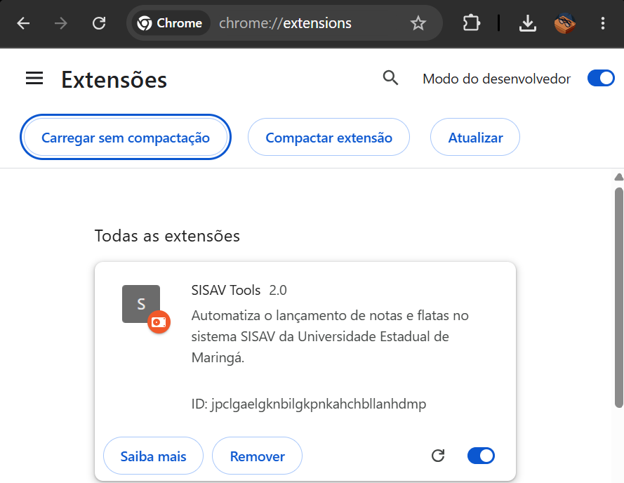
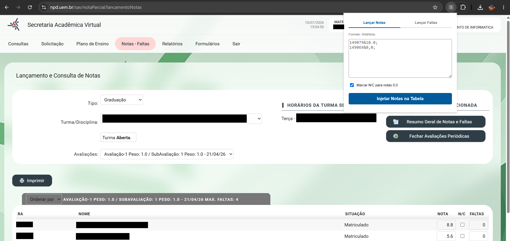
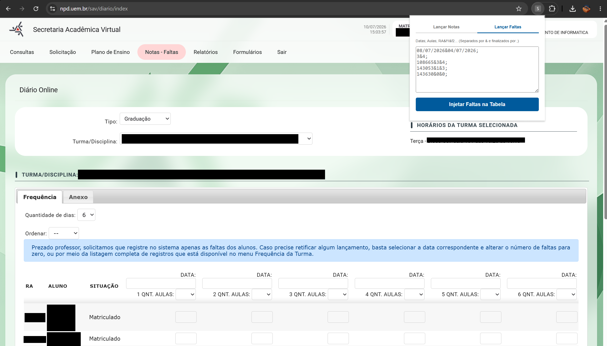

# SISAV Tools - Versão 2.0

O **SISAV Tools** é uma extensão para navegadores baseados em Chromium desenvolvida com o objetivo de automatizar e agilizar o processo de lançamento de notas e faltas no sistema SAV/SISAV da Universidade Estadual de Maringá (UEM). A extensão elimina a necessidade de digitação manual aluno por aluno, injetando os dados diretamente na interface do sistema a partir de cadeias de texto estruturadas.

---

## ⚠️ Disclaimer (Aviso Importante)

Esta extensão foi projetada exclusivamente para professores que utilizam planilhas eletrônicas (como Microsoft Excel ou Google Planilhas) para o gerenciamento de notas e faltas de suas turmas. 

Para que o ecossistema funcione corretamente, **é indispensável que a sua planilha de controle possua a coluna com o RA (Registro Acadêmico) do aluno**. O RA é o identificador único utilizado pela extensão para localizar a linha correspondente de cada estudante na página do SISAV e realizar a injeção dos dados de forma segura. Se a sua planilha não utiliza os RAs dos alunos, esta extensão não terá utilidade prática.

---

## 📦 Como Instalar a Extensão

Como a extensão é de uso interno e distribuída diretamente pelo código-fonte, a instalação deve ser feita através do modo de desenvolvedor do navegador.

### Google Chrome
1. Baixe ou clone este repositório para o seu computador e certifique-se de manter todos os arquivos (`manifest.json`, `popup.html` e `popup.js`) dentro da pasta `chromeExtension`.
2. Abra o Google Chrome e acesse o endereço: `chrome://extensions/`
3. No canto superior direito da tela, ative a chave **"Modo do desenvolvedor"**.
4. No canto superior esquerdo que surgirá, clique em **"Carregar sem compactação"**.
5. Selecione a pasta `chromeExtension` onde os arquivos estão salvos.



### Outros Navegadores Compatíveis (Microsoft Edge, Brave, Opera)
A extensão é 100% compatível com qualquer navegador baseado em Chromium.
* **Microsoft Edge:** Acesse `edge://extensions/`, ative o "Modo de desenvolvedor" e clique em "Carregar expandida".
* **Brave:** Acesse `brave://extensions/` e siga os mesmos passos do Chrome.

---

## 🖥️ Apresentação e Uso da Extensão

Após a instalação, clique no ícone de quebra-cabeça do seu navegador (Extensões) e fixe o **SISAV Tools** na barra de ferramentas para facilitar o acesso.

### 3.1 Guia de Lançamento de Notas

#### Como Utilizar:
1. Acesse o sistema SISAV na página oficial de lançamento de notas da turma desejada. **A página precisa estar completamente carregada e com os campos de entrada de nota visíveis.**
2. Clique no ícone do **SISAV Tools** e certifique-se de que a aba **"Lançar Notas"** está selecionada.
3. Cole o bloco de texto formatado no campo de texto principal.
4. Se desejar que notas iguais a `0,0` sejam convertidas automaticamente em **N/C (Não Compareceu)**, mantenha a caixa *"Marcar N/C para notas 0,0"* marcada.
5. Clique em **"Injetar Notas na Tabela"**. Não feche a janela ou mude de aba até que o alerta de conclusão apareça.



#### Sintaxe dos Dados Aceita:
Os dados devem seguir estritamente o formato `RA&Nota;`, onde cada aluno é separado por um ponto e vírgula (`;`). A nota pode utilizar tanto ponto quanto vírgula como separador decimal.

**Exemplo de entrada:**
```text
149079&10.0;
149069&7,5;
143221&0,0;
```

---

### 3.2 Guia de Lançamento de Faltas

#### Como Utilizar:
1. Acesse a página do SISAV correspondente ao lançamento de faltas da turma. Selecione a quantidade máxima de dia (neste caso 6 dias), mesmo quando pretenda lançar uma quantidade menor de dias. A tabela de alunos deve estar visível na tela, com os campos de datas e nomes dos alunos.
2. Clique no ícone do **SISAV Tools** e mude para a aba **"Lançar Faltas"**.
3. Cole o bloco de texto estruturado contendo as datas, número de aulas e as faltas correspondentes de cada RA.
4. Clique em **"Injetar Faltas na Tabela"**. 

*Nota de funcionamento:* A extensão realiza um rodízio automático de colunas (do índice 1 ao 6) no SISAV, preenchendo as datas nos campos de datas, definindo a quantidade de aulas daquele dia no campo correspondente e aguardando o tempo de validação do banco de dados antes de preencher as faltas de cada aluno.



#### Sintaxe dos Dados Aceita:
O lançamento de faltas exige uma estrutura em linhas, onde **todas as linhas devem terminar com ponto e vírgula (`;`)**:
* **Linha 1:** Lista de datas das aulas separadas por `&`.
* **Linha 2:** Quantidade de aulas ministradas em cada respectiva data, separadas por `&`.
* **Linhas 3 em diante:** O `RA` do aluno seguido pelo número de faltas que ele teve em cada um dos dias (na ordem das datas especificadas), separados por `&`.

*Importante:* Se o aluno teve 0 faltas ou se o campo for deixado em branco, a extensão ignorará este aluno no dia correspondente por segurança, evitando sobrescrever dados existentes.

**Exemplo de entrada:**
```text
08/07/2026&10/07/2026;
3&4;
108665&3&4;
143053&1&0;
143630&0&2;
```
*No exemplo acima: O aluno do RA 108665 teve 3 faltas no dia 08/07 e 4 faltas no dia 10/07. O aluno 143053 teve 1 falta no dia 08/07 e nenhuma no dia 10/07.*

---

## 4. Integração com Excel (Preparação Manual)

Para gerar o texto nos formatos exigidos pela extensão, você poderá utilizar fórmulas de concatenação no Excel para juntar as colunas de dados da sua planilha. Consulte o arquivo `modelo-faltas-notas.xlsx` disponibilizado que traz exemplos de fórmulas úteis aplicados ao modelo de lista de presença da UEM.

### 4.3 Possíveis Erros e Cuidados Importantes

#### O Problema do "Zero à Esquerda" nos RAs
Um dos erros mais comuns de integração ocorre com RAs que começam com o número zero (ex: `098432`), por conta disso, é importante que o RA seja tratado como texto no Excel.